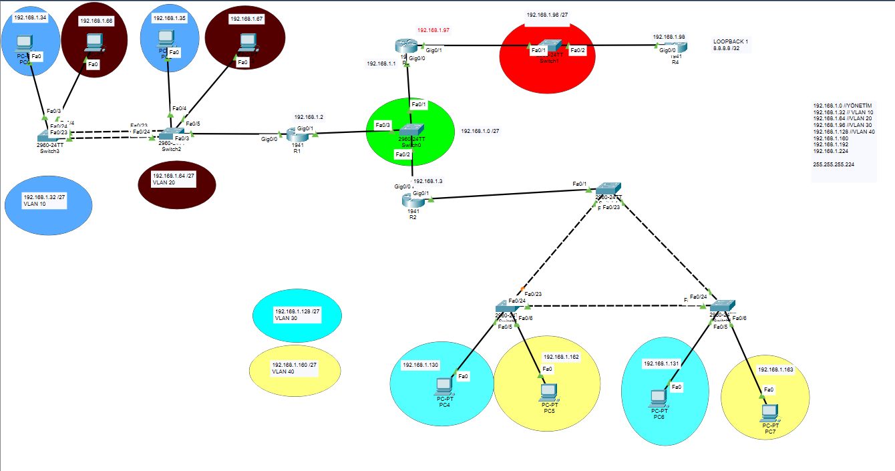

# CCNA FLSM ve VLAN Segmentasyon Labı

## 📌 Proje Açıklaması

Bu lab çalışmasında CCNA seviyesinde FLSM (Fixed Length Subnet Mask) subnetting ve VLAN segmentasyonu konularını uygulamalı olarak ele aldım.

Amaç, 192.168.1.0/24 ağı üzerinden eşit büyüklükte subnetler oluşturarak bu subnetleri farklı VLAN’lara atamak ve ağın mantıksal olarak nasıl bölümlere ayrıldığını gözlemlemekti.

Bu çalışma; subnetting, VLAN yapısı, trunk bağlantılar ve temel routing kavramlarını pekiştirmek amacıyla hazırlanmıştır.

---

## 🧠 Çalışılan Konular

- FLSM (Fixed Length Subnet Mask)
- /27 subnet hesaplama
- VLAN segmentasyonu
- Broadcast domain kavramı
- Switchler arası trunk (802.1Q)
- Router-on-a-Stick (ROAS)
- Static Routing
- Default Route mantığı
- Loopback interface kullanımı
- Temel IP planlama

---

## 🌐 IP ve VLAN Planı

| VLAN    | Network Adresi      | Subnet Mask     | Kullanılabilir IP Aralığı     | Broadcast Adresi |
|---------|---------------------|-----------------|-------------------------------|------------------|
| YÖNETİM | 192.168.1.0/27      | 255.255.255.224 | 192.168.1.1 - 192.168.1.30    | 192.168.1.31     |
| VLAN 10 | 192.168.1.32/27     | 255.255.255.224 | 192.168.1.33 - 192.168.1.62   | 192.168.1.63     |
| VLAN 20 | 192.168.1.64/27     | 255.255.255.224 | 192.168.1.65 - 192.168.1.94   | 192.168.1.95     |
| VLAN 30 | 192.168.1.128/27    | 255.255.255.224 | 192.168.1.129 - 192.168.1.158 | 192.168.1.159    |
| VLAN 40 | 192.168.1.160/27    | 255.255.255.224 | 192.168.1.161 - 192.168.1.190 | 192.168.1.191    |

---

## 📷 Topoloji

---

## ⚙️ Lab İçeriği

Bu lab kapsamında aşağıdaki yapılandırmalar gerçekleştirilmiştir:

- 192.168.1.0/24 ağı /27 subnetlere bölündü (FLSM)
- Her VLAN için ayrı bir subnet tanımlandı
- Router üzerinde Router-on-a-Stick (ROAS) yapılandırması yapıldı
- Switchler üzerinde VLAN oluşturma ve port atamaları gerçekleştirildi
- Switchler arası bağlantılar trunk (802.1Q) olarak ayarlandı
- Uzak ağlara erişim için static route tanımlandı
- Loopback interface oluşturularak ISP simülasyonu yapıldı
- Default route ile trafik merkezi bir noktaya yönlendirildi
- İstemcilere uygun IP adresleri atandı
- VLAN’ların ayrı broadcast domain oluşturduğu gözlemlendi

---

## 🧪 Kullanılan Araçlar

- Cisco Packet Tracer
- Cisco 2960 Switch
- Cisco 1941 Router
- PC istemciler

---

## 🎯 Öğrenilenler

Bu çalışma sayesinde subnetting’in sadece teorik bir konu olmadığını, gerçek ağ tasarımında VLAN’lar ile birlikte kullanıldığını daha net anladım.

Özellikle şu kavramlar pekişti:

- Her VLAN ayrı bir broadcast domain oluşturur
- Genellikle her VLAN ayrı bir subnet ile temsil edilir
- FLSM kullanıldığında tüm subnetler eşit büyüklükte olur
- Routing olmadan VLAN’lar birbirleriyle iletişim kuramaz
- Default route, bilinmeyen trafik için kritik bir rol oynar

---

## 🚀 Sonraki Adımlar

Bu lab’in devamında aşağıdaki konuları ayrı çalışmalar halinde geliştirmeyi planlıyorum:

- Access Control List (ACL)
- DHCP yapılandırması
- Dynamic Routing (OSPF / RIP)
- STP analizi
- Daha büyük ölçekli network tasarımları